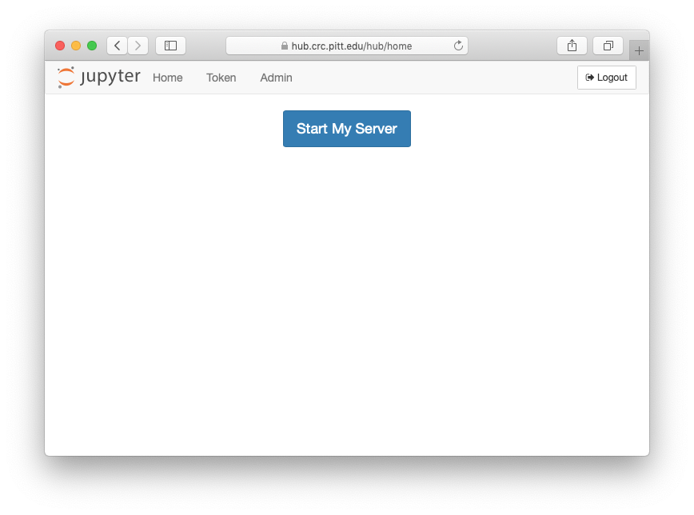
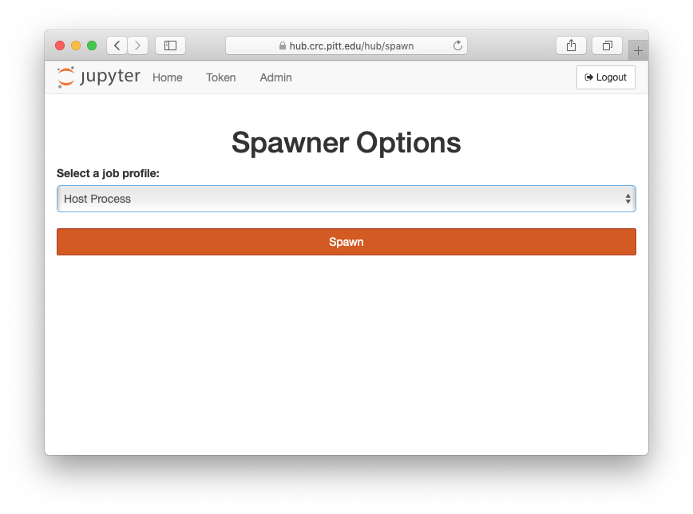
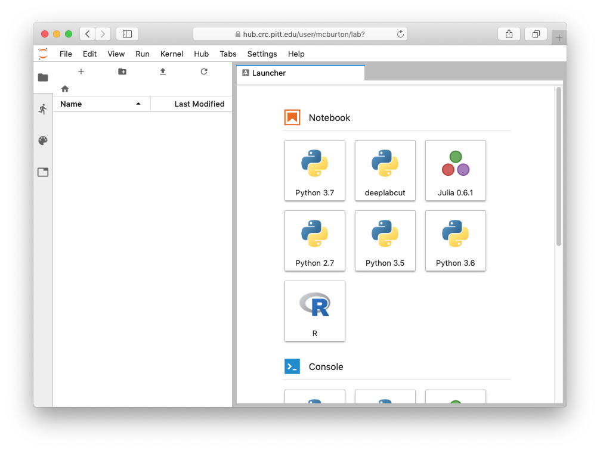

# CMPINF0010 Skills Lab 
# Week 2 - Introduction to Jupyter & the Stack

Welcome to the Lab session for CMPINF0010 Big Ideas in Computing and Information.

This week is going to focus on getting you oriented with the technology stack we will be using in the lab sessions for this course. The primary technologies we will be using is a platform called [Jupyter](http://jupyter.org) and the [Python](http://python.org) programming language. Jupyter is an open-source project that maintains a collection of tools for interactive computing. Python is an extremely popular general purpose programming language that has become widely used in the data science community. With their powers combined, Jupyter and Python make easy to interactively execute code to explore data. In the Big Ideas skills lab we will be doing just that!

More specifically, here are the main technologies you will be using in the skills lab:
* **Python** - A general purpose programming language that is both easy to learn and very powerful. 
* **JupyterLab** - JupyterLab is a web-based interactive development environment for Jupyter notebooks, code, and data.
* **Jupyter Notebooks** - The Jupyter Notebook is an open-source standard that allows you to create and share documents that contain live code, equations, visualizations and narrative text.
* **JupyterHub** - A multi-user version of Jupyter running on a remote server.


We will be using *JupyterLab* to create, edit, and execute *python* in *Jupyter Notebooks* in the lab sessions. We will be running JupyterLab on the [School of Computing and Information's](http://sci.pitt.edu) instance of JupyterHub. What this means is that you do not need to install any software on your own computer, everything will be running up "in the cloud" and you will only need a web browser to access it.


## Overview

This week's lab session has 5 parts.

1. Logging into the SCI JupyterHub
2. Using JupyterLab
3. Downloading Lab Materials
4. Introduction to Jupyter Notebooks
5. Uploading completed labs to Box

---

## Help Outside the "Classroom"

There is a new discord server for this class! More information to come soon(TM)!


---

## Part 1 - What is the SCI Jupyterhub?

The SCI Jupyterhub is actually a supercomputer! We’re accessing it for a couple reasons. It has a system installed on it that simplified working on the labs; it removes the need to install all the individual programs to open and edit Jupyter notebooks.  This means regardless whether you’re accessing the hub from a PC or a Mac or a Tablet, you are able to write and execute anything you need in your notebook. Also, it’s really convenient to have everything chilling on the CRC, you’ll be able to access it from any machine as long as you have a browser and an internet connection.

The other nice thing about using Jupyter Hub is that it operates on its own file system.  This means everybody has a standard system to navigate, simplifying the process of debugging and fixing errors.

### How to login to the CRC Jupterhub:

This is the first big task of the lab sections.  Don’t worry, it’s very difficult:
1.	Go to https://jupyterhub.sci.pitt.edu.
2.	Log in with your Pitt credentials
    * Note: don't inlcude @pitt.edu, and your username needs to be all lowercase (e.g. abc12 is good, but ABC12 and abc12@pitt.edu are **not**)
3.	Verify yourself with Two Factor Authentication
4.	Click `Start my Server`
5.	Select `Host Process` from the dropdown (should be default), then hit `Spawn`
6.	That’s it, you’re in

Start my Server


Spawn the Host Process



Congratulations! You are now logged into JupyterHub. Your screen should (hopefully) look something like this:



Welcome to Jupyter Lab!

### It didn't work!

Don't worry, if you are unable to log into Jupyter Hub, we have set up an alternative on another JupyterHub called [Binder](http://mybinder.org). By clicking the link below you will be connected to a free instance of Jupyter running in the cloud. 

**Important Note:** If you are running on Binder and files or notebooks you create will be deleted after an hour of inactivity. Download anything you create to your local machine in order to preserve it (you will have to do this to hand in the lab exercises anyway)

* Click here if SCI Hub doesn't work: [](https://mybinder.org/v2/gh/pitt-sci-cmpinf0010/week-2/master?urlpath=lab)


---

## Part 2 - Introduction to Using JupyterLab

Before we begin, please watch this video for a basic walk through for using JupyterLab so you can begin to acquaint yourself with its different features.
* https://www.youtube.com/watch?v=K2Yb1nXTmYM  (Ignore the stuff about MatrixDS)

### Creating a Notebook
Your lab sessions and exercises will mainly be using Jupyter Notebooks--which allow you to write pieces of code and/or markdown in an organized fashion. **We will be using Python 3.7, so be sure to select that when you are making a Notebook.** Remember to use good naming techniques when creating files and folders.

### Understanding the File System
Just as your computer has a system of files with a hierarchical order to them, your files in JupyterLab is organized in a similar way. You can create folders to place lab materials and lectures in, then put folders inside of folders if you would like! 

These files are not on your local machine, they live on the CRC JupyterHub (which has A LOT more space than your computer). You can upload and download files from this remote file system using the JupyterLab web interface.

### The Terminal and Text Editor
We will be using the terminal for a variety of things during this class, but as explained an important use for it will be to download lab materials. Another good use for it is to navigate through files and run programs. 
The text file editor is useful for keeping information in, such as lists and certain data. We will learn more about doing this later in the semester!

---

## Part 3 - Downloading Lab Materials

1. In Canvas, click **2204 CMPINF 0010 SEC1010**
2. Now, click **Modules**
3. Click **Skills Lab Week 2**
4. Login with your Pitt credentials
5. Congrats! You should see this week's lecture open in Jupyter Hub


---

## Part 4 - Introduction to Jupyter Notebooks

During the course of this, uh, course, you'll be completing your labs and final projects in the Jupyter notebook format. A **Jupyter notebook** is a combination of executable code, formatted text, and raw data.

A Jupyter notebook is, at its core, a bunch of *cells* on top of an interactive *kernel*. This explanation necessarily oversimplifies some things, but you can think of each notebook as having its own kernel that all of its cells can access and modify. So, for example, if you say `a = 123` in `Notebook1.ipynb`, any code cell within `Notebook1.ipynb` can see the value of `a`, but `Notebook2.ipynb` is unaware of the existence of the variable `a`. (For a counterexample, try clicking on the "Python 3" in the upper-right corner of a notebook once you're on JupyterHub. Have fun.)

The specific kernel we're using is an interactive version of Python 3 called IPython. This naming convention holds; the default Ruby kernel for Jupyter is called IRuby, for example. Many programming languages have interactive kernels for creating notebooks, but we'll be sticking to Python 3 for this course. 

### Cells

Within the Jupyter notebook, there are three types of cells: code, Markdown, and raw. These cells can exist in any order within the notebook, and can be mixed and matched as you, the author, wish to do so. 

**Code cells** are the core of the Jupyter notebook's computation. They contain code that is run by the kernel. When you run a cell, any variables you assign are assigned for any code cell in the document, and any output your code produces is displayed directly below the cell.


**Markdown cells** are the default way to display rich text, tables, images, GIFs, videos, and math markup. Markdown is a subset of HTML optimized for writing text quickly, and correspondingly is pretty lightweight. For example,

```markdown
# This Is A Header

Here's some **bold text**, and here's some *italics*. I can make a list like so:

* bullet
* points
* use
* asterisks

1. and
2. numbered
3. lists
4. just
5. use
6. numbers :)


I can also [link to things](https://www.pitt.edu) with parentheses and brackets. 

Adding an image is like a link, but more excited:

```

It's easy to display `code` with backticks(\`). Longer code snippets get their own line:

    ```
    print("Here's a longer snippet of code.")
    a = 2
    b = 3
    c = a + b
    ```

You can see a full guide to Markdown [here](https://github.com/adam-p/markdown-here/wiki/Markdown-Cheatsheet), and we'll discuss it in more detail later in the course. But, for now, just know that you can write pretty text within a Jupyter notebook using Markdown cells.

**Raw cells** are the simplest cell type in Jupyter. They just contain raw, unformatted data that's not evaluated or changed in any way. If you want to include raw data points or text that's important to display as-is, raw cells are your best bet. We'll rarely use them in this course.

---

## Part 5 - Lesson & Exercises


The materials you downloaded in Part 3 contain a Notebook with instructions for this week's exercise. 

In the `week-2` folder, open the `week-2-lab-lesson.ipynb` Jupyter Notebook. Read through this notebook and follow the instructions. You will be instructed to create a new Jupyter Notebook with some Markdown text, images, and Python code. This is the notebook you will hand in using Canvas (instructions below).

---

## Part 6 - Uploading completed labs to Canvas


We will use [Canvas](canvas.pitt.edu) to let you upload your labs. 

1. First, you're going to have to download the notebook to your computer.
    * On JupyterHub, right click on your exercise notebook on your file browser on the left
    * Click **Download** and save it somewhere

2. Then, go to Canvas to upload you lab.
    * In Canvas, click on our class, then Modules
    * Click on the Skills Lab module for this week
    * Click **Submit Assignment** in the top right
    * Choose your Notebook file you downloaded earlier (will end in `.ipynb`)
    * Hit Submit!


Note: you can re-upload your lab as many times as you want before the deadline.

